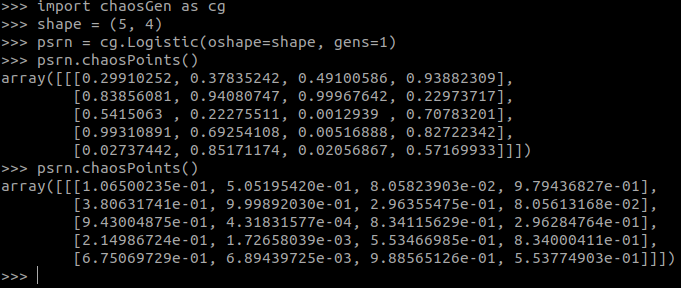

# Gradient Approximation and FCPSO

Contains implementation of [Adaswarm](https://arxiv.org/abs/2006.09875) by *Mohapatra et. al* and also its modification by Chaotic Random Number Generators in the module [chaosGen.py](chaosGen.py). Below is an example of the Chaotic Pseudo-Random-Number-Generator.

Also contains implementation of [FCPSO-em](fcpso.py), which is a modification of SMPSO with exponentially-averaged momentum adapted to single-objective problems. 

The aim of adaswarm is for gradient approximation in neural networks. We have tested adaswarm on simple 1 dimensional objective functions for the accuracy of its gradient. It has worked well on a highly non-linear and multimodal Rastrigin function. Please check [this](Adaswarm.ipynb) notebook for the demo.

This repository also contains the implementation of a novel PSO algorithm named *Reverse-Informed Locally-Searched PSO*. A demo of this PSO variant can be found in [this](RILC-PSO.ipynb) notebook. The special feature of this variant is that it is capable of detecting multiple equally fit global optima. Please refer to the details of which can be found [here](https://www.researchgate.net/publication/344891493_Reverse-Informed_Locally-Searched_PSO).

